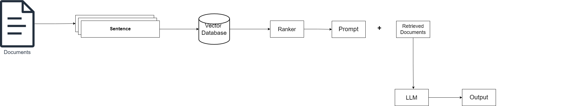
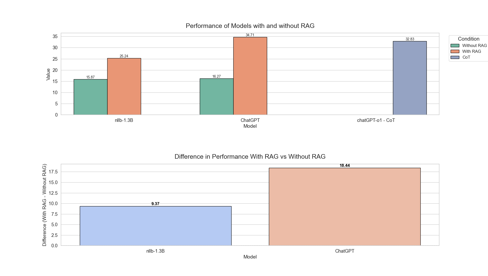
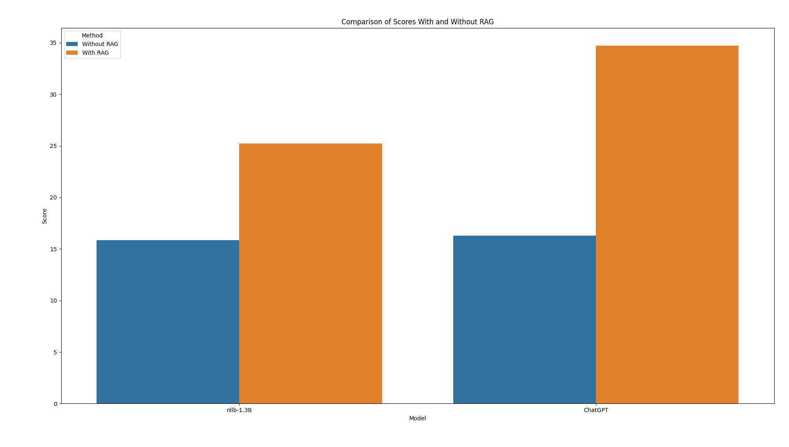

# 📘 Translation Evaluation

Evaluation of different strategies on LLM translation

---

## 🧠 Project Summary

This research investigates the effectiveness of two advanced techniques—**Retrieval-Augmented Generation (RAG)** and **Chain of Thought (CoT)**—in enhancing Large Language Model (LLM) translation capabilities. The focus is on conversational French-to-English translation, especially on informal and culturally rich dialogues. This study evaluates both individual and combined effects of RAG and CoT.

---

## 📐 Architecture

---

## 🔍 RAG and CoT Difference

---

## 📈 Improvement Observed

---

## 📋 Methodology Overview

- **Baseline Evaluation** using standard LLM translation
- **Data Selection**: 10,000 sentence pairs with informal expressions, slang, idioms
- **Technique Implementation**:
  - RAG: Uses external document retrieval to provide context-aware translation
  - CoT: Uses step-by-step reasoning to capture nuanced meanings
- **Evaluation Metrics**: BLEU scores and human evaluation for adequacy, fluency, and cultural accuracy

---

## 🧪 Models Evaluated

- `facebook/nllb-200-distilled-1.3B`
- `ChatGPT`
- `ChatGPT-o1-preview`

---

## 📝 Key Findings

- **RAG** improved BLEU scores significantly across all tested models
- **CoT** led to more human-like translations with better preservation of humor and context
- Combined usage of RAG and CoT produced the most effective results for conversational accuracy

---

## 📚 References

A full list of academic references and resources is provided in the accompanying [report](./report.pdf).

---

## 👨‍💻 Contributors

- **Ajaykumar Premkumar Nair** — B00968276  
  ✉️ ajay.nair@dal.ca

- **Manish Shankar Jadhav** — B00969328  
  ✉️ mn649712@dal.ca
